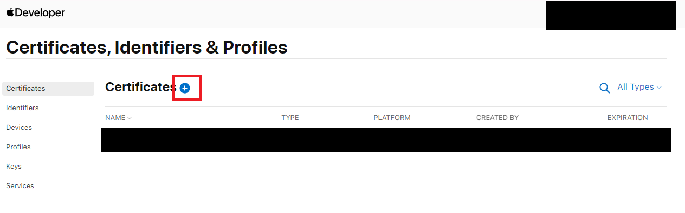
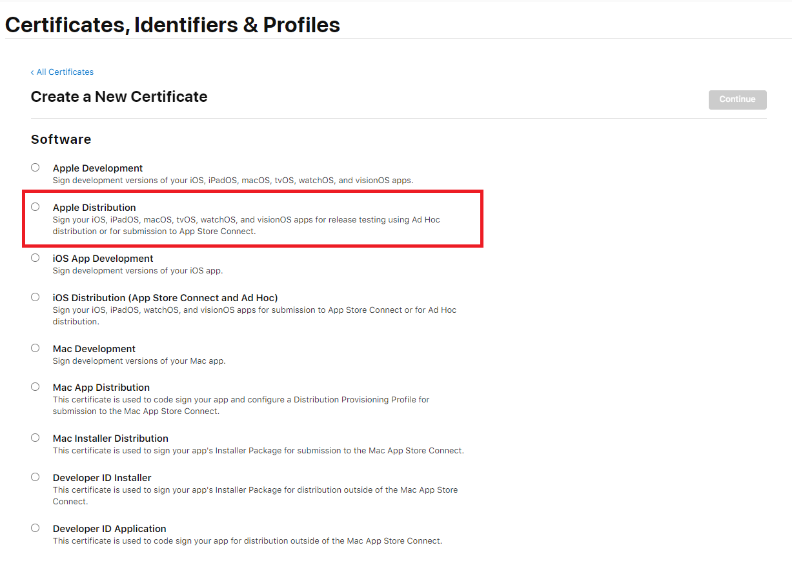
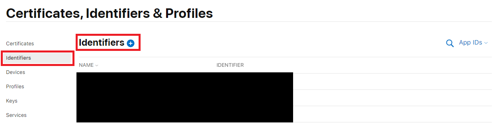
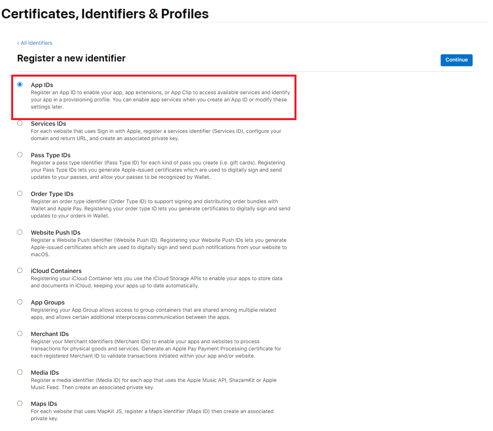
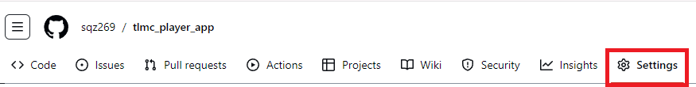
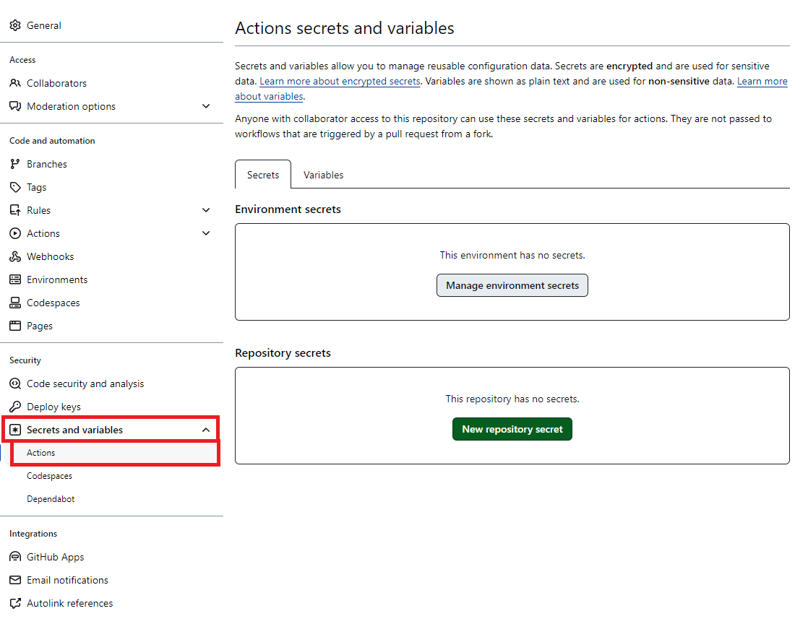

# Building Flutter App For iOS On Windows With Github Actions For On Device Testing With OTA Distribution (Ad-Hoc Distribution)

## Prerequisites

- An Apple Developer Account
- Access to Linux terminal (wsl ok)

## Enabling iOS support for your Flutter app

1. If your flutter project already have the `ios` folder but **DOES NOT** have `ios/Podfile` in it. Delete the `ios` folder and follow the section. If you do have the `Podfile` then this section may be skipped
2. Copy the `.github/workflows/ios-enable-support.yml` to your own github repo
3. Follow [this](https://docs.github.com/en/actions/managing-workflow-runs-and-deployments/managing-workflow-runs/manually-running-a-workflow) docs to run the **Add iOS Support and Export Tarball** workflow
4. Once the workflow completes, follow [this](https://docs.github.com/en/actions/managing-workflow-runs-and-deployments/managing-workflow-runs/downloading-workflow-artifacts) docs to download the exported artifact
5. Extract the artifact and copy it's `ios` folder to your repo, you should now see a `Podfile` in the `ios` folder

## Tutorial: Finding Flutter Bundle ID

*Before following this section, ensure that you have read through and followed* **Enabling iOS support for your Flutter app** *section*

Bundle ID is needed to create an identifier, if you need to find the iOS bundle ID, follow this section.

1. Open `ios/Runner.xcodeproj/project.pbxproj`
2. The Bundle ID should be show in `PRODUCT_BUNDLE_IDENTIFIER=` line

## Setting up Apple Developer Account and Certificates

### Setting up Developer Certificates

Instructions Taken from Source: <https://gist.github.com/boodle/77436b2d9facb8e938ad>

**Ensure openssl is installed before continuing**

1. Generating a certificate signing request using OpenSSL

    ```sh
    openssl req -nodes -newkey rsa:2048 -keyout ios_enterprise.key -out CertificateSigningRequest.certSigningRequest
    ```

    - This will generate a private key and a signing request, ensure the private key stay secure and we will use it later to combine with the public certificate to sign our application.

2. Securely store the password for the CSR (This password will be referred as ***CSR Password*** from here on)

3. Navigate to Apple Developer Certificate List Page at <https://developer.apple.com/account/resources/certificates/list> and Sign in

4. Add a Certificate by Clicking the Blue **+** (plus) button

    

    1. Select **Apple Distribution** (You may select other certificate types but OTA may not work properly)
        
    2. Then Click the Blue Continue button located on the top-right corner to continue
    3. Upload the CSR file (`CertificateSigningRequest.certSigningRequest`) you generated from the first step

5. Download the `distribute.cer` and put it in the same dir as the signing request

6. Convert `distribution.cer` into a `p12` file (The `.p12` certificate will be referred as ***BUILD CERTIFICATE*** from here on)
    1. Execute command `openssl x509 -in distribution.cer -inform DER -out ios_enterprise.pem -outform PEM`
    2. `openssl pkcs12 -export -inkey ios_enterprise.key -in ios_enterprise.pem -out ios_enterprise.p12 -legacy` (Password is required, and note that `-legacy` flag is needed for openssl v3+)

7. Securely store the password for the P12 (This password will be referred as ***BUILD CERTIFICATE Password*** from here on)

### Adding an Identifier

1. On the same **Certificates, Identifiers & Profiles** page where you selected Certificate. Now choose the Identifiers tab to add an app identifier
    
2. Select **App IDs** and Click on **Continue**
    
3. Then select **App** and Click on **Continue**
4. This step requires a bundle ID, if you need to find your flutter app's bundle ID, follow instruction in the section **Tutorial: Finding Flutter Bundle ID**
    1. Put your Flutter app's bundle ID and enter a description for the Identifier
    2. Select the capabilities your apps need
    3. Then Click on **Continue**, and Then **Register**

### Adding your Device to allow On Device Testing

Follow the instructions from [here](https://developer.apple.com/help/account/register-devices/register-a-single-device/) to add devices you want to use for testing

### Creating a Provisioning Profile

1. On the same **Certificates, Identifiers & Profiles** page where you selected Certificate. Now choose the Profiles tab to add a new Provisioning Profile
2. Select **Ad Hoc** and Click on **Continue**
3. Select the App ID that you created from previous section and Click on **Continue**
4. Select the **Certificate** and click on **Continue**
5. Select the **Devices** you want to use for testing and click on **Continue**
6. Enter a name for the profile and click on **Generate**
7. Download the profile and store it in the same directory as the certificates. The downloaded profile will be referred as ***PROVISIONING PROFILE*** from here on

## Configuring Github Actions

This section details on how to add the secretes required to run the workflow

1. Navigate to the GitHub repository that hosts your Flutter code
2. Go to repository settings
    
3. On the side bar, choose `Secretes and Variables > Actions`
    
4. You will be adding repository secretes so use the `New repository secret` to add the following secretes

### Adding Secretes (Section Title are the Secret Name)

#### IOS_BUILD_CERTIFICATE_BASE64

This is based on your ***BUILD CERTIFICATE*** File, you will need to convert the file into base64 format and store it in the secret

Use the following command to convert the file into base64 format

```sh
base64 -w 0 -i ios_enterprise.p12
```

Then copy the content of `ios_enterprise_base64.txt` and paste it into the secret

#### IOS_BUILD_CERTIFICATE_PASSWORD

This is the ***BUILD CERTIFICATE Password*** you created when converting the certificate into a `p12` file

#### IOS_GITHUB_KEYCHAIN_PASSWORD

This is the password you want to use for the keychain, it can be any string you want

#### IOS_MOBILE_PROVISIONING_PROFILE_BASE64

This is based on your ***PROVISIONING PROFILE*** File, you will need to convert the file into base64 format and store it in the secret

Use the following command to convert the file into base64 format

```sh
base64 -w 0 -i ios_enterprise.mobileprovision
```

Then copy the content of `ios_enterprise.mobileprovision` and paste it into the secret
